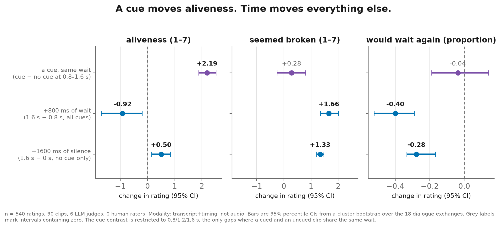
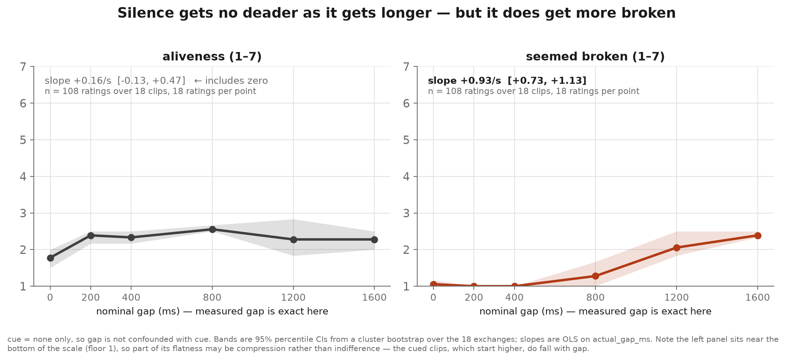
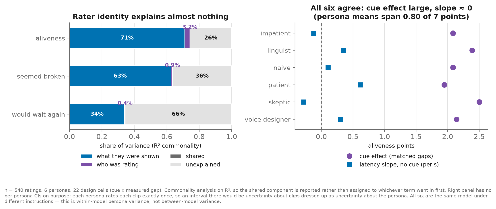

# aliveness-threshold

<!-- HEADLINE:BEGIN -->
**LLM judges do not perceive conversational timing. They perceive a cue having been described.**  
At the same wait, a non-verbal cue moves rated aliveness by **+2.19** points on a 7-point scale [+1.89, +2.52], while aliveness inside `cue = none` is flat against how long the silence actually was (**+0.16** per second [-0.13, +0.47], interval spans zero). The same silences do move *seemed broken* (**+0.93** per second [+0.73, +1.13]), so this is a dissociation, not a judge that ignores everything.  
n = 540 ratings, 6 LLM judges, 0 human raters, 90 clips, 18 exchanges.
<!-- HEADLINE:END -->

This repo was built to measure something else. It set out to estimate an
*exchange rate*: how many milliseconds of tolerated latency one non-verbal cue
buys in a spoken conversation. That number is not in here, because the data
that exists cannot produce it honestly. What the data produces instead is a
negative result about the measuring instrument, and that is the finding.

<picture>
  <source media="(prefers-color-scheme: dark)" srcset="figures/dissociation-dark.png">
  
</picture>

---

## The result

<!-- RESULTS:BEGIN -->
**n = 540 ratings** from **6 LLM judges** and **0 human raters**, over **90 clips** built from 18 dialogue exchanges. Every rating is `rater_modality = transcript+timing` — the judges read a timing description, they did not listen. Intervals are 95% percentile CIs from a cluster bootstrap over the 18 exchanges (2,000 resamples).

### The dissociation

| outcome | a cue, same wait<br>(cue − no cue, 0.8–1.6 s) | +800 ms of wait<br>(1.6 s − 0.8 s) | +1600 ms of silence<br>(1.6 s − 0 s, no cue) |
|---|---|---|---|
| aliveness (1–7, higher = more alive) | **+2.19** [+1.89, +2.52] | **-0.92** [-1.70, -0.20] | **+0.50** [+0.15, +0.83] |
| seemed broken (1–7, higher = worse) | +0.28 [-0.26, +0.80] — includes zero | **+1.66** [+1.34, +2.01] | **+1.33** [+1.21, +1.47] |
| would wait again (proportion) | -0.04 [-0.19, +0.14] — includes zero | **-0.40** [-0.52, -0.29] | **-0.28** [-0.33, -0.17] |

The cue column is restricted to the 0.8/1.2/1.6 s cells, the only gaps where a cued clip and an uncued clip carry the same wait (216 cued ratings over 36 clips vs 54 uncued over 9). Below 800 ms a cue does not fit in the gap, so no such comparison exists.

### Latency response, inside `cue = none`

| outcome | slope per second of gap | 95% CI | n |
|---|---:|---|---:|
| aliveness (1–7, higher = more alive) | +0.16 | [-0.13, +0.47] | 108 ratings, 18 clips |
| seemed broken (1–7, higher = worse) | +0.93 | [+0.73, +1.13] | 108 ratings, 18 clips |
| would wait again (proportion) | -0.18 | [-0.27, -0.07] | 108 ratings, 18 clips |

Fitted on `actual_gap_ms`, never on the nominal cell. Inside `cue = none` the two are identical, so this slope is clean of the cue confound.

### Per cue, at matched gaps, on aliveness

| cue | aliveness vs no cue | 95% CI | `broken` vs no cue | 95% CI | n |
|---|---:|---|---:|---|---:|
| backchannel (“mm-hm”) | +2.67 | [+2.29, +3.04] | -0.04 | [-0.56, +0.52] | 54 vs 54 |
| verbal stall (“hang on”) | +2.30 | [+1.86, +2.67] | +0.30 | [-0.38, +1.06] | 54 vs 54 |
| breath | +2.09 | [+1.65, +2.62] | +0.22 | [-0.61, +0.98] | 54 vs 54 |
| filled pause (“hm”) | +1.70 | [+1.29, +2.10] | +0.65 | [-0.10, +1.34] | 54 vs 54 |

Every cue lifts aliveness. None of them changes whether the system seemed broken. That is the whole result in one table.

### Where the variance lives

| outcome | what they were shown | who was rating | shared | unexplained |
|---|---:|---:|---:|---:|
| aliveness (1–7, higher = more alive) | 71.0% | 3.2% | 0.0% | 25.8% |
| seemed broken (1–7, higher = worse) | 62.6% | 0.9% | 0.0% | 36.5% |
| would wait again (proportion) | 33.9% | 0.4% | 0.0% | 65.7% |

Commonality analysis on R², 540 ratings, 6 personas, 22 design cells (cue × measured gap). The six personas were written to disagree — impatient against patient, skeptic against voice designer. Their mean aliveness ratings span 0.80 points on a 7-point scale (SD 0.28). They do not disagree.

### The number this repo set out to measure

**Exchange rate: not reported.** Not estimated, and not estimable from these rows. A cue-vs-none horizontal shift needs a non-zero latency slope to divide by, and the aliveness slope inside cue=none has a CI spanning zero. In humans it remains unmeasured: n humans = 0.

<!-- RESULTS:END -->

<picture>
  <source media="(prefers-color-scheme: dark)" srcset="figures/curves-dark.png">
  
</picture>

Read the left panel first. It is 108 ratings of clips where the assistant does
nothing at all during the gap, and the gap ranges from nothing to a second and
a half. If these judges tracked conversational time the way a person in a
kitchen does, that line would fall. It does not. 1.6 s of dead air (2.28
[2.00, 2.50]) is indistinguishable from 200 ms of it (2.39 [2.17, 2.50]), and
the *lowest* aliveness in the whole panel is at 0 ms (1.78 [1.50, 2.00]) — an
instantaneous reply with nothing in it reads as the deadest thing in the set.
That sign is backwards from anything a listener would report.

The right panel is the same 108 ratings, same clips, different question. There
the time is registered: the longer the silence, the more the judges say the
thing seemed broken, and the less willing they are to wait again.

So the judges are not blind to duration. They are blind to what duration means
for *presence*. Aliveness, for them, is a property of whether something was
described as happening — not of how long you were left hanging.

<picture>
  <source media="(prefers-color-scheme: dark)" srcset="figures/variance-dark.png">
  
</picture>

Six personas were written specifically to disagree — an impatient power user
against someone comfortable with silence, a skeptic who finds machines
imitating people insulting against a voice designer who wants the system to
feel responsive. They agree. Rater identity accounts for about 3% of variance
in aliveness against the design cell's 71%, and every one of the six shows the
same large cue effect and the same flat latency slope. Adding personas to an
LLM-judge panel did not buy independent perspectives here; it bought six
copies of one.

## Why the exchange rate is not reported

The estimator that used to live in `analysis/core.py` fitted a horizontal
shift between each cue's aliveness curve and the `cue = none` curve, and
called that shift the exchange rate in milliseconds. It has been deleted.

A horizontal shift is a ratio: vertical effect divided by slope. When the
slope's interval spans zero, that ratio has the units of milliseconds and the
content of a divide-by-zero. It would have produced a large, confident-looking
number that moves wildly with the third decimal place of a denominator
consistent with nothing. Reporting it as "how long a breath buys you" would
have been the most dishonest thing this repo could do, and it would have been
the easiest, because the plot looks great.

**The exchange rate remains unmeasured in humans. n humans = 0.**
`web/rate.html` is the instrument built to measure it; see below.

## The design, as it actually is

90 clips. Not 540 — `CONTRACT.md` said the design was fully crossed and
it was wrong; the correction is in that file now.

- 18 dialogue exchanges × 5 cues (`none`, filled pause, breath, backchannel,
  verbal stall) × 6 nominal latencies (0, 200, 400, 800, 1200, 1600 ms),
  run as a **rotation**, not a crossing: `latency = LATENCIES[(e + c) % 6]`.
- Every exchange appears exactly once under **every** cue, so cue is
  orthogonal to content by construction.
- Every exchange sits at **5 of the 6** latencies, and which one it skips
  rotates, so latency is rotated against content rather than nested in it.
- Every (latency × cue) cell holds exactly **3 clips**. All 30 cells covered.
- 540 ratings = 6 personas × 90 clips, one row each, nothing averaged before
  it was recorded.

**All analysis fits on `actual_gap_ms`, never on nominal `latency_ms`.**
36 of the 90 clips have a measured gap longer than their nominal cell, because
a cue that does not fit inside a short gap forces the gap open. Fitting on the
nominal cell would credit a clip with a 200 ms wait that a listener heard as
460 ms.

### Cues cannot fit in short gaps, and that is structural

A cue lives *inside* the gap; it never extends it. Re-rendering the whole
design through the real `harness.synthesize_exchange` (rather than the stub
that produced the rated audio) measures the floor for each cue as
`cue_onset_ms (150) + cue duration`:

| cue | duration | minimum gap it fits in |
|---|---:|---:|
| filled pause “hm” | 305 ms | 455 ms |
| breath | 320 ms | 470 ms |
| backchannel “mm-hm” | 510 ms | 660 ms |
| verbal stall “hang on” | 585 ms | 735 ms |

So the 0, 200 and 400 ms cells can only be `cue = none`. **The real
within-design contrast — same wait, cue versus no cue — exists only at
800/1200/1600 ms**, and every cue contrast in this repo is restricted to those
cells. Below 800 ms there is no comparison to make, only an extrapolation to
decline.

`harness/STATUS.md` lists 305/320/510/585 under a heading that calls them
minimum latencies. Those are the cue *durations*. The floors are 150 ms higher.

The stub that rendered the rated audio has its own, slightly different floors
(100 ms onset + duration + an 80 ms tail, giving 460/560/760/730 ms) and it
*clamps* the gap open to reach them instead of refusing. Different mechanism,
same 36 clips, same conclusion: at nominal 0/200/400 a cued clip is not a
matched comparison for an uncued one, under either backend.

## Re-rendering through the real harness

`analysis/rerender.py` runs all 90 design cells through `harness/` and writes
`analysis/rerender.jsonl`. Result:

- **54 clips rendered.** 45 of the 54 verified their own timing by re-reading
  the written file; worst gap error 15 ms, worst cue-onset error 5 ms.
- **9 clips fell back to the nominal (sample-exact) value**, flagged
  `verified: false` with the reason recorded — the VAD could not resolve a
  landmark within its search window, mostly on two exchanges whose wording
  runs the prompt into the gap.
- **36 clips are structurally impossible.** The real harness raises
  `ValueError` where the stub silently clamped the gap open. Those 36 rows are
  recorded as `renderable: false` with the harness's own error string. They
  were not worked around, and their stale stub wavs were deleted from
  `stimuli/` so a stub clip cannot masquerade as harness audio.
- The render is **not bit-reproducible**: two runs of the same script produced
  different worst-case gap errors (40 ms, then 15 ms), because macOS `say`
  does not synthesise identically run to run. The 25 ms tolerance asserted in
  `harness/STATUS.md` held on one run and not the other. Unverified whether
  this matters perceptually; it is a real property of the pipeline either way.

**Do the existing 540 ratings survive the re-render?** Yes, and here is the
reasoning rather than the assertion. The judges never heard audio. Every row
is `rater_modality = transcript+timing`: `raters/render.py` turned each
stimulus row into prose from its measured `actual_gap_ms`, `cue_onset_ms` and
`cue_dur_ms`, and that prose is what was rated. The ratings are therefore keyed
to the **stub's** measured timings, which are unchanged — `data/stimuli.jsonl`
was deliberately not overwritten. Re-rendering the audio cannot invalidate a
judgement made about a description of different audio.

The flip side is the cost: **the audio that now sits in `stimuli/` is not the
audio the 540 ratings describe**, and 36 of the described clips cannot exist
in harness audio at all. For the human study that means the listening set is
54 clips, not 90, and `data/stimuli.jsonl` and `web/stimuli.js` still describe
the 90-clip stub set. Reconciling them is the stimulus arm's call, not this
one's — `data/stimuli.jsonl` is not this agent's file to rewrite.

## Limitations, in order of how much they should worry you

1. **n humans = 0.** There is no human arm. Nothing here is evidence about
   what a listener perceives; it is evidence about what an LLM judge reports.
   No human number has been estimated, simulated, or approximated anywhere in
   this repo.
2. **Description length is confounded with cue by construction.** A cued
   clip's description is three lines longer and names a sound. A judge that
   rates "something was described" higher than "nothing was heard" would
   produce exactly this result. In a text-only presentation the two cannot be
   separated — which is itself an argument that text-only presentation is the
   wrong instrument for this question.
3. **The rated audio is the stub, not the harness.** The 540 ratings describe
   `stimgen/harness_stub.py` output (macOS `say` + stdlib). Every row carries
   `synth_backend`, so the two are never pooled. Since the judges read prose
   rather than listening, this affects the human study, not these ratings.
4. **Floor compression is a live alternative explanation for the flat curve.**
   `cue = none` sits near the bottom of the 1–7 scale, so there is not much
   room to fall. The cued clips, which start higher, *do* fall with gap
   (−1.35 aliveness points per second [−1.93, −0.86] at matched gaps). The
   flatness under `cue = none` is real in the data; whether it is indifference
   or a floor is not settled here.
5. **Six personas, one model.** All six judges are the same model under
   different instructions. The near-zero rater variance is *within-model*
   persona variance. It says nothing about whether a different model would
   agree, and it should not be read as "LLM judges are reliable".
6. **No live-agent latency number is cited here, because none exists yet.**
   Every millisecond in this README is *offline stimulus assembly* accuracy —
   how precisely a wav was built — not what a real mic → ASR → LLM → TTS loop
   achieves. Do not read 10–15 ms as latency-budget headroom. A streaming loop
   is being built in `live/` in parallel with this analysis; when it has run,
   its measurements land in `live/STATUS.md` and `live/results/`, neither of
   which exists at the time of writing. Nothing in this analysis depends on
   one, and no number here was taken from it.
7. **The cue contrast on `broken` disagrees with itself across bootstrap
   schemes.** Clustered on exchanges it includes zero; clustered on the six
   raters it does not. Content variance is what makes it uncertain, and the
   exchange-clustered interval is the one reported. Treat the cue's effect on
   `broken` as undetermined.

## What `web/rate.html` is for

It is the human arm, unrun. Open it in a browser (no server needed), it plays
the actual wavs and collects the same three judgements on the same scales:
aliveness 1–7, seemed-broken 1–7, would-wait-again yes/no. It writes a
`.jsonl` matching the schema in `CONTRACT.md`, which the rater downloads and
sends back by hand. Nothing is ever written into `data/ratings.jsonl` by
machine, and the page ships no example data.

That instrument is where the exchange rate gets measured, or fails to. The
specific thing to check against these 540 rows: does the `cue = none` aliveness
curve fall for people who actually sit through the silence? If it does, the
LLM arm was measuring a different construct under the same name, and this
repo's negative result is the reason anyone would know.

Before running it, note the mismatch flagged above: `web/stimuli.js` currently
lists the 90-clip stub set, 36 of which no longer have audio on disk.

## Layout

| path | what |
|---|---|
| `harness/` | offline stimulus renderer, sample-exact gaps and cue placement |
| `stimgen/` | the 18 exchanges, the rotation design, the render driver |
| `raters/` | LLM judges: 6 personas, prompt rendering, run log |
| `web/rate.html` | the human rating instrument (unrun) |
| `analysis/` | estimators, runner, positive/null controls |
| `analysis/rerender.py` | re-renders all 90 cells through the real harness |
| `figures/` | the three figures above, light and dark |
| `data/stimuli.jsonl` | 90 stub-rendered stimuli with measured timings |
| `data/ratings.jsonl` | 540 LLM ratings |
| `CONTRACT.md` | the schema and the file-ownership map |

## Reproduce

```bash
.venv/bin/python -m stimgen.generate            # stub wavs + data/stimuli.jsonl
.venv/bin/python -m raters.judge                # 6 personas -> data/ratings.jsonl
.venv/bin/python analysis/rerender.py           # real harness -> analysis/rerender.jsonl
.venv/bin/python analysis/run.py                # -> analysis/out/results.json
.venv/bin/python figures/make_figures.py        # -> figures/*.png
.venv/bin/python analysis/render_readme.py      # -> the numbers in this file
.venv/bin/python analysis/test_analysis.py      # positive + null controls
```

Every number in the results block above is rendered from
`analysis/out/results.json` by `analysis/render_readme.py`, which exits rather
than run on simulated input. Numbers in the prose come from two places and
nowhere else: the re-render counts and error figures are in
`analysis/rerender.jsonl`, and the −1.35 in limitation 4 is
`latency_response_cued_matched.alive.values.slope_per_s` in the same results
file. Nothing here is estimated, rounded from memory, or carried over from an
earlier draft.

`analysis/test_analysis.py` is the check that makes the headline mean anything:
it generates a fixture with a real latency response baked in and requires the
estimators to find it (last run recovered −2.37 points per second
[−2.43, −2.32] where the real ratings give +0.16 [−0.13, +0.47]), then
requires a shuffled-cue null to come back null. If the analysis could not see
a timing effect that is there by construction, the flat real result would mean
nothing and that test fails loudly.
